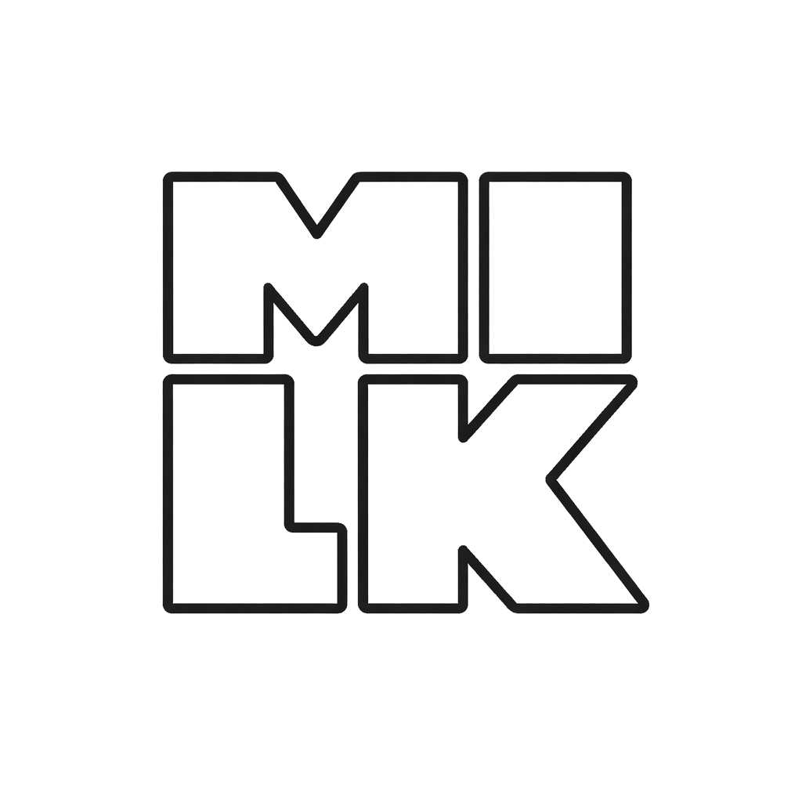

# Atlas Vivo MILK



[](https://joinup.ec.europa.eu/collection/eupl/eupl-text-eupl-12)
[](https://orcid.org/0009-0007-6892-6570)
[](https://github.com/milkivc/atlas-vivo-milk)

**Infraestrutura cultural digital soberana para leitura territorial, património cultural imaterial, memória, evidência, curadoria e criação de possibilidades de intervenção.**

O Atlas Vivo MILK liga **território → fonte → evidência → hipótese → possibilidade → validação humana → ação cultural**.

## A peça diferenciadora

A **Camada Invisível** é o núcleo analítico, curatorial, metodológico e técnico que opera por detrás da experiência pública. **Invisível não significa confidencial.** A confidencialidade é uma classificação transversal independente, aplicada por objeto, dado, documento, segredo, credencial ou obrigação legal.

O código pode ser público, licenciável ou reservado conforme a classificação jurídica do objeto. A camada contém motores de evidência, leitura territorial, hipótese, incerteza, contradição, temporalidade, sinais fracos, campo do possível, correspondência curatorial e financiamento, sempre com **validação humana obrigatória**.

## O que já está implementado

O núcleo `src/territorial-reader` inclui:

- preservação e grafo de evidência;
- independência/dependência entre fontes;
- contradições candidatas;
- análise temporal;
- sinais fracos;
- ausência documentada;
- problema territorial inverso;
- lenteamento territorial;
- fissão de problemas;
- transições de estado;
- leitura espacial e material;
- pressão estrutural;
- realidade institucional;
- capacidade instalada;
- vitalidade simbólica;
- desertos territoriais;
- motor do campo do possível;
- correspondência curatorial;
- correspondência de financiamento em estado `A_VERIFICAR`;
- não-maleficência;
- mundo aberto;
- publicação bloqueada até validação humana.

## Prova técnica

O commit `83e14c574a16c67b9811a9bdef03a076f809c337` foi validado pelo workflow **MILK Territorial Reader — saneamento e hypothesis engine** com:

- **47 testes passados / 0 falhas**;
- verificação sintática de todos os módulos JavaScript;
- testes anti-fabricação e de hipótese;
- `mock_runtime_allowed=0`;
- `open_world=yes`;
- gate humano obrigatório;
- verificação de fonte territorial oficial;
- verificação de ausência de material comum de segredo em texto simples.

## Para financiadores e parceiros

O repositório tem agora um dossiê de leitura direta para financiamento, cooperação e diligência:

### ➜ [FUNDING.md — Funding & Partnership Brief](FUNDING.md)

O documento organiza:

- tese de inovação;
- valor público e cultural;
- Camada Invisível + IA MILK;
- prova técnica;
- património cultural imaterial;
- interoperabilidade;
- propriedade intelectual;
- modelo de comercialização;
- identidade institucional;
- pacotes de trabalho financiáveis;
- portas de financiamento;
- estrutura de orçamento;
- indicadores auditáveis.

## Autoria, gestão e propriedade intelectual

**Autor exclusivo do software:** Eduardo Maurício Vieira Cabral e Araujo  
**Nome artístico:** Eduardo Mauer  
**ORCID:** 0009-0007-6892-6570

**Gestão institucional e manutenção:** Associação MILK — Movimento de Intervenções e Linguagens Kulturais e Arte  
**NIPC:** 518706451  
**Website:** https://associacaomilk.pt

A identidade visual MILK funciona como **assinatura visual autoral e institucional**. O logótipo, sinal gráfico e identidade visual não são automaticamente abrangidos pela licença do código.

Metadados e direitos:

- [`metadata/territorial-reader/AUTHORSHIP_AND_RIGHTS.json`](metadata/territorial-reader/AUTHORSHIP_AND_RIGHTS.json)
- [`metadata/territorial-reader/licensing-policy.json`](metadata/territorial-reader/licensing-policy.json)
- [`metadata/territorial-reader/codemeta.json`](metadata/territorial-reader/codemeta.json)
- [`metadata/territorial-reader/logo-milk-eduardo-mauer.xmp`](metadata/territorial-reader/logo-milk-eduardo-mauer.xmp)
- [`assets/rights/logo-milk-eduardo-mauer-xmp.png`](assets/rights/logo-milk-eduardo-mauer-xmp.png)

## Licenciamento e sustentabilidade económica

O projeto usa um modelo de **licenciamento dual**:

1. **EUPL-1.2** para distribuições públicas identificadas como tal;
2. **licença comercial/proprietária separada**, quando juridicamente admissível e contratualmente definida.

A sustentabilidade económica pode incluir implantação dedicada, alojamento gerido, integrações institucionais, conectores privados, suporte, SLA, formação, auditoria, personalização territorial, curadoria, módulos específicos e serviços profissionais.

Ver: [`docs/legal/LICENSING_AND_COMMERCIALISATION.md`](docs/legal/LICENSING_AND_COMMERCIALISATION.md).

## Interoperabilidade

O Atlas prepara interoperabilidade sem confundir abertura técnica com abertura de dados ou transferência de direitos:

`JSON` · `JSON-LD` · `JSON Schema` · `OpenAPI` · `GeoJSON` · `DCAT-AP` · `GeoDCAT-AP` · `Dublin Core` · `DataCite` · `CodeMeta` · `CITATION.cff` · `PROV-O` · `SKOS` · `IIIF` · `W3C Web Annotation` · `SPDX` · `REUSE` · `ORCID` · `ROR` · `SWHID`.

## Património cultural imaterial e recolha

A recolha cultural é governada por documentação legal, proveniência, consentimento quando aplicável, MatrizPCI, estados de validação e separação entre dado, interpretação, hipótese e publicação.

Festas, oralidades, memórias, topónimos, brincadeiras, práticas, saberes e outros elementos vivos são tratados como processos culturais situados, não como simples linhas de base de dados.

## Estrutura técnica

```text
atlas-vivo-milk/
├── assets/
│   ├── public/
│   └── rights/
├── docs/
│   ├── legal/
│   ├── technical/
│   └── territorial-reader/
├── manifests/
├── metadata/
│   └── territorial-reader/
├── ops/
├── src/
│   ├── backend/
│   ├── frontend/
│   └── territorial-reader/
├── CITATION.cff
├── FUNDING.md
├── GOVERNANCE.md
├── LICENSE
├── SECURITY.md
└── README.md
```

## Princípio de segurança metodológica

O Atlas não deve:

- inventar dados territoriais;
- transformar metáfora em pseudociência;
- classificar pessoas ou comunidades por inferência sensível;
- converter hipótese em facto automaticamente;
- publicar sem validação humana;
- confundir ausência de resultado com inexistência;
- desligar evidência da sua fonte e proveniência.

## Contacto

**Associação MILK — Movimento de Intervenções e Linguagens Kulturais e Arte**  
**Email:** milk@associacaomilk.pt  
**Website:** https://associacaomilk.pt
