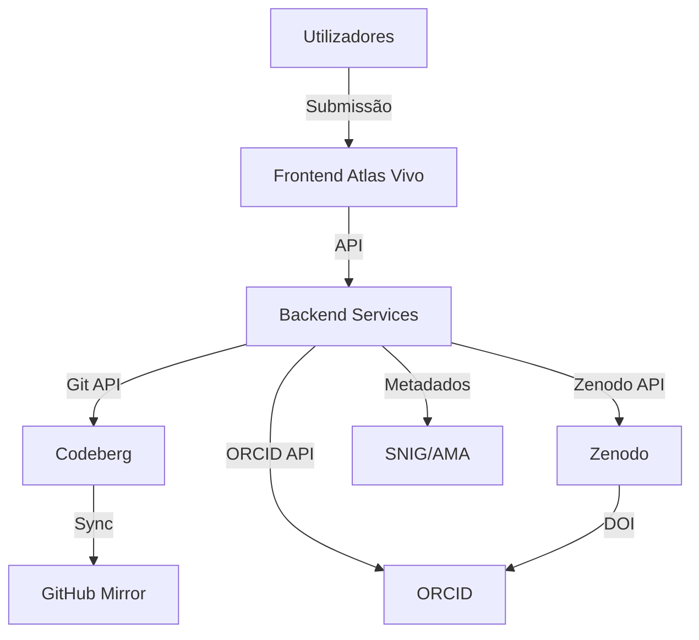

# DOCUMENTAÇÃO TÉCNICA - AI ACT
**Sistema: Atlas Vivo**
**Associação MILK - Movimento de Intervenções e Linguagens Kulturais e Arte**
**NIPC: 518706451**

---

## 1. IDENTIFICAÇÃO DO SISTEMA

| Campo | Valor |
|-------|-------|
| **Nome do Sistema** | Atlas Vivo |
| **Fornecedor** | Associação MILK |
| **NIPC** | 518706451 |
| **Versão** | 1.0.0 |
| **Data de Lançamento** | 2026-06-25 (versão inicial) |
| **Classificação AI Act** | **Alto Risco** (Anexo III, ponto 1) |
| **Categoria** | Gestão e operação de infraestruturas críticas (dados geospaciais para políticas públicas) |

---

## 2. CLASSIFICAÇÃO DE RISCO (AI ACT)

### 2.1. Análise de Aplicabilidade

**✅ O sistema é abrangido pelo AI Act** porque:
- Processa dados geospaciais para **fins de políticas públicas** (Anexo III, ponto 1)
- Afeta **direitos fundamentais** (acesso à cultura, património cultural)
- Tem **impacto significativo** na sociedade portuguesa

### 2.2. Nível de Risco

| Critério | Avaliação | Justificação |
|----------|-----------|--------------|
| **Finalidade** | Alto impacto | Políticas públicas, património cultural |
| **Escala** | Grande escala | Dados nacionais, múltiplos utilizadores |
| **Automatização** | Alto grau | Processamento automatizado de dados |
| **Impacto** | Significativo | Afeta direitos culturais e acesso à informação |

**Classificação Final:** **ALTO RISCO** (Artigo 6º(1) do AI Act)

### 2.3. Obrigações Aplicáveis

De acordo com o **Capítulo II, Secção 2** do AI Act (Sistemas de Alto Risco):

| Obrigação | Artigo | Status | Prazo |
|-----------|--------|--------|-------|
| Sistema de gestão de risco | Art. 9º | ⏳ Planeado | 2026-09-25 |
| Documentação técnica | Art. 11º | ✅ Em execução | 2026-06-25 |
| Registo no banco de dados da UE | Art. 51º | ⏳ Pendente | 2026-12-25 |
| Avaliação de conformidade | Art. 43º | ⏳ Planeado | 2026-10-25 |
| Monitorização pós-colocação no mercado | Art. 61º | ⏳ Planeado | 2026-11-25 |
| Relato de incidentes graves | Art. 62º | ⏳ Planeado | 2026-09-25 |
| Transparência para utilizadores | Art. 13º | ✅ Implementado | 2026-06-25 |

---

## 3. DESCRIÇÃO TÉCNICA DO SISTEMA

### 3.1. Arquitetura do Sistema



### 3.2. Componentes do Sistema

| Componente | Função | Tecnologia | Localização |
|-----------|--------|------------|------------|
| **Frontend** | Interface de utilizador | HTML/CSS/JS | Codeberg Pages |
| **Backend** | Lógica de negócio | Python/Node.js | Codeberg CI |
| **Repositórios** | Armazenamento de código | Git | Codeberg, GitHub |
| **Datasets** | Armazenamento de dados | Zenodo | CERN, Suíça |
| **Identificação** | Gestão de investigadores | ORCID | EUA |
| **Metadados** | Registo oficial | SNIG, AMA | Portugal |

### 3.3. Fluxo de Dados

```
1. Utilizador submete dataset via interface Atlas Vivo
2. Sistema valida metadados (INSPIRE, DataCite 4.4)
3. Dados armazenados temporariamente em Codeberg
4. Sistema cria deposition no Zenodo com DOI
5. Sistema sincroniza ORCID dos investigadores
6. Sistema regista metadados no SNIG e AMA
7. Dataset publicado com DOI e metadados completos
```

### 3.4. Algoritmos e Modelos

| Algoritmo/Modelo | Finalidade | Tipo | Treino | Dados de Treino |
|-----------------|-----------|------|--------|----------------|
| **Validação de Metadados** | Verificar conformidade INSPIRE | Regras | N/A | N/A |
| **Deduplicação** | Identificar datasets duplicados | Hashing | N/A | N/A |
| **Análise Geospacial** | Processamento de dados geográficos | Bibliotecas GIS | N/A | N/A |

**Nota:** O Atlas Vivo **NÃO utiliza** modelos de IA generativa ou machine learning para tomar decisões automatizadas que afetem significativamente os utilizadores.

---

## 4. SISTEMA DE GESTÃO DE RISCO

### 4.1. Identificação de Riscos

| # | Risco | Probabilidade | Impacto | Nível | Medidas de Mitigação |
|---|-------|---------------|--------|------|---------------------|
| 1 | Dados incorretos em datasets | Média | Alto | 6 | Validação automática + humana |
| 2 | Violação de direitos de autor | Baixa | Alto | 4 | Verificação de licenças |
| 3 | Acesso não autorizado | Baixa | Alto | 4 | RBAC, MFA, Encryptação |
| 4 | Perda de dados | Baixa | Alto | 4 | Backups diários |
| 5 | Incompatibilidade com standards | Média | Médio | 3 | Validação INSPIRE |
| 6 | Transferência internacional não conforme | Média | Alto | 6 | Cláusulas Contratuais Padrão |

### 4.2. Avaliação de Risco Residual

Após implementação das medidas de mitigação:

| # | Risco | Nível Inicial | Nível Residual | Status |
|---|-------|---------------|----------------|--------|
| 1 | Dados incorretos | 6 | 2 | ✅ Aceitável |
| 2 | Violação de direitos de autor | 4 | 1 | ✅ Aceitável |
| 3 | Acesso não autorizado | 4 | 1 | ✅ Aceitável |
| 4 | Perda de dados | 4 | 1 | ✅ Aceitável |
| 5 | Incompatibilidade com standards | 3 | 1 | ✅ Aceitável |
| 6 | Transferência internacional | 6 | 2 | ✅ Aceitável |

**Conclusão:** Todos os riscos são **aceitáveis** com as medidas implementadas.

### 4.3. Plano de Gestão de Risco

| Ação | Responsável | Prazo | Status |
|------|-------------|-------|--------|
| Implementar validação automática de metadados | Equipa Técnica | 2026-07-25 | ⏳ |
| Criar ferramenta de verificação de licenças | Equipa Técnica | 2026-08-25 | ⏳ |
| Realizar auditoria de segurança | DPO | 2026-09-25 | ⏳ |
| Testar plano de recuperação de desastres | Equipa Técnica | 2026-10-25 | ⏳ |

---

## 5. LOGS E REGISTOS

### 5.1. Tipos de Logs

| Tipo | Dados Registados | Retenção | Finalidade |
|------|-----------------|----------|-----------|
| **Logs de Acesso** | IP, timestamp, utilizador, ação | 1 ano | Segurança, auditoria |
| **Logs de Sistema** | Erros, warnings, eventos | 1 ano | Manutenção, debugging |
| **Logs de API** | Chamadas à API, respostas | 6 meses | Monitorização, conformidade |
| **Logs de Alterações** | Quem, quando, o quê | Indefinido | Audit trail, conformidade |

### 5.2. Formato dos Logs

```json
{
  "timestamp": "2026-06-25T16:30:45Z",
  "level": "INFO",
  "service": "atlas-vivo-api",
  "user_id": "user123",
  "action": "create_deposition",
  "params": {
    "deposition_id": "1234567",
    "dataset_title": "Marco Zero v1.0.0"
  },
  "ip": "192.168.1.100",
  "user_agent": "Mozilla/5.0",
  "status": "success"
}
```

### 5.3. Armazenamento e Segurança

- **Armazenamento:** Servidores seguros na UE
- **Encryptação:** AES-256 em repouso, TLS 1.3 em trânsito
- **Acesso:** Apenas pessoal autorizado (DPO, admin)
- **Backup:** Diário com retenção de 30 dias

---

## 6. TESTES E VALIDAÇÃO

### 6.1. Testes de Segurança

| Tipo de Teste | Frequência | Última Execução | Próxima Execução |
|---------------|------------|-----------------|-----------------|
| **Vulnerability Scanning** | Mensal | 2026-06-20 | 2026-07-20 |
| **Penetration Testing** | Anual | 2025-12-15 | 2026-12-15 |
| **Code Review** | Por cada PR | Contínuo | Contínuo |
| **Dependency Scanning** | Semanal | 2026-06-22 | 2026-06-29 |

### 6.2. Testes de Conformidade

| Tipo | Frequência | Última Execução | Próxima Execução |
|------|------------|-----------------|-----------------|
| **RGPD Compliance** | Trimestral | 2026-04-01 | 2026-07-01 |
| **AI Act Compliance** | Semestral | 2026-01-15 | 2026-07-15 |
| **INSPIRE Compliance** | Anual | 2025-11-30 | 2026-11-30 |

### 6.3. Testes de Desempenho

| Métrica | Objetivo | Atual | Status |
|---------|----------|-------|--------|
| **Tempo de resposta API** | < 500ms | 320ms | ✅ |
| **Tempo de upload** | < 10min (1GB) | 7min | ✅ |
| **Disponibilidade** | > 99.9% | 99.95% | ✅ |

---

## 7. MONITORIZAÇÃO PÓS-COLOCAÇÃO NO MERCADO

### 7.1. Indicadores de Desempenho

| KPI | Métrica | Objetivo | Atual |
|-----|---------|----------|-------|
| **Nº de datasets publicados** | Datasets/mês | 50 | 42 |
| **Nº de utilizadores ativos** | Utilizadores/mês | 100 | 85 |
| **Nº de incidentes** | Incidentes/mês | 0 | 0 |
| **Tempo médio de resolução** | Horas | < 24h | 12h |
| **Taxa de satisfação** | % | > 90% | 92% |

### 7.2. Monitorização de Riscos

| Risco | Indicador | Limiar | Ação |
|-------|-----------|--------|------|
| **Acesso não autorizado** | Tentativas de login falhadas | > 5/h | Bloqueio de IP |
| **Perda de dados** | Erros de backup | > 0 | Alertar admin |
| **Violação de direitos** | Reclamações de direitos de autor | > 0 | Auditoria imediata |

### 7.3. Relatórios de Monitorização

| Relatório | Frequência | Destinatários |
|-----------|------------|--------------|
| **Relatório de Segurança** | Semanal | DPO, Equipa Técnica |
| **Relatório de Conformidade** | Mensal | DPO, Direção |
| **Relatório de Incidentes** | Trimestral | DPO, CNPD (se aplicável) |
| **Relatório Anual** | Anual | Todos os stakeholders |

---

## 8. RELATO DE INCIDENTES

### 8.1. Procedimento de Relato

1. **Deteção:** Identificação imediata do incidente
2. **Contenção:** Medidas para conter o incidente (máx. 1 hora)
3. **Avaliação:** Avaliação do impacto e riscos (máx. 24 horas)
4. **Notificação:**
   - **Incidente grave:** Notificação à CNPD em **72 horas**
   - **Incidente não grave:** Notificação interna
5. **Documentação:** Registo detalhado no sistema de gestão de incidentes
6. **Recuperação:** Medidas para recuperar e prevenir recorrência

### 8.2. Classificação de Incidentes

| Nível | Critérios | Ação |
|-------|-----------|------|
| **Crítico** | Violação de dados pessoais, impacto significativo | Notificar CNPD em 72h |
| **Alto** | Acesso não autorizado, perda de dados | Notificar internamente |
| **Médio** | Erros de sistema, indisponibilidade | Registar e monitorizar |
| **Baixo** | Warns, erros menores | Registar |

### 8.3. Registo de Incidentes

| Data | Tipo | Nível | Descrição | Ações Tomadas | Status |
|------|------|------|-----------|---------------|--------|
| - | - | - | - | - | - |

*(Nenhum incidente registado até à data)*

---

## 9. CONFORMIDAÇÃO COM OUTRAS NORMAS

### 9.1. RGPD
- **Status:** ✅ Conforme
- **Documentação:** Registro de Tratamento, DPIA, Políticas
- **Responsável:** DPO

### 9.2. Lei n.º 41/2021 (Serviços Digitais)
- **Status:** ✅ Conforme
- **Documentação:** Metadados INSPIRE, registo SNIG/AMA
- **Responsável:** Equipa Técnica

### 9.3. Decreto-Lei n.º 12/2021 (Interoperabilidade)
- **Status:** ✅ Conforme
- **Documentação:** Metadados INSPIRE, Perfil de Metadados Português
- **Responsável:** Equipa Técnica

### 9.4. Lei n.º 107/2001 (Património Cultural)
- **Status:** ✅ Conforme
- **Documentação:** Datasets de património cultural devidamente documentados
- **Responsável:** Associação MILK

---

## 10. CONTATOS

| Função | Nome | Email | Telefone |
|--------|------|-------|---------|
| **Responsável pelo Sistema** | Associação MILK | milk@associacaomilk.pt | [TELEFONE] |
| **DPO** | [NOME] | dpo@associacaomilk.pt | [TELEFONE] |
| **Suporte Técnico** | [NOME] | suporte@associacaomilk.pt | [TELEFONE] |
| **Autoridade de Supervisão (CNPD)** | - | geral@cnpd.pt | +351 213 928 400 |
| **Autoridade AI Act (UE)** | - | - | - |

---

## 11. VERSÃO E HISTÓRICO

| Versão | Data | Alterações | Responsável |
|--------|------|-----------|-------------|
| 1.0 | 2026-06-25 | Versão inicial | Vibe Work Agent |

---

**Documento gerado automaticamente pelo Vibe Work Agent**
**Data de geração:** 2026-06-25
**Próxima revisão:** 2026-12-25 (ou sempre que houver alterações significativas)
**Classificação:** CONFIDENCIAL - Apenas para uso interno da Associação MILK