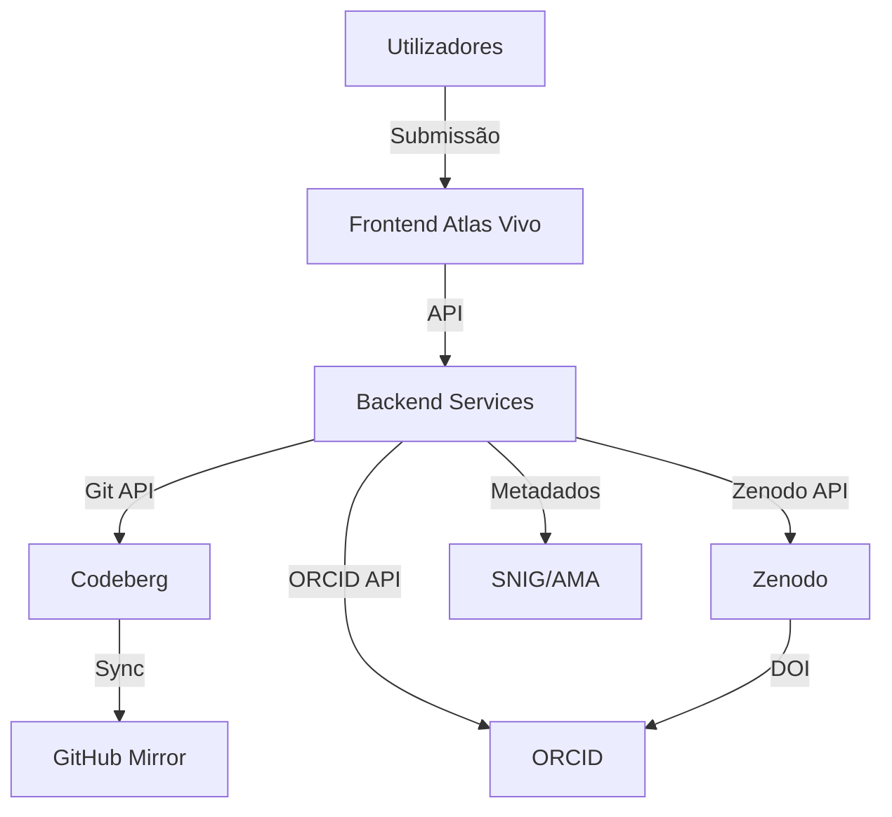

# DOCUMENTAÇÃO TÉCNICA - AI ACT
Sistema: Atlas Vivo
Associação MILK - Movimento de Intervenções e Linguagens Kulturais e Arte
NIPC: 518706451

---

## 1. IDENTIFICAÇÃO DO SISTEMA

| Campo | Valor |
|-------|-------|
| Nome do Sistema | Atlas Vivo |
| Fornecedor | Associação MILK |
| NIPC | 518706451 |
| Versão | 1.1.0 |
| Data de Lançamento | 2026-06-25 (versão inicial), 2026-07-10 (atualização) |
| Classificação AI Act | Alto Risco (Anexo III, ponto 1) |

---

## 3. DESCRIÇÃO TÉCNICA DO SISTEMA

### 3.1. Arquitetura do Sistema

### 3.2. Componentes do Sistema

| Componente | Função | Tecnologia | Localização |
|-----------|--------|------------|------------|
| Frontend | Interface de utilizador | HTML/CSS/JS | Codeberg Pages |
| Backend | Lógica de negócio | Python/Node.js | Codeberg CI |
| Repositórios | Armazenamento de código | Git | Codeberg, GitHub |

---

## VERSÃO

| Versão | Data | Alterações |
|--------|------|-----------|
| 1.0 | 2026-06-25 | Versão inicial |
| 1.1 | 2026-07-10 | Atualização de diagramas Mermaid |

---

Data: 2026-07-10